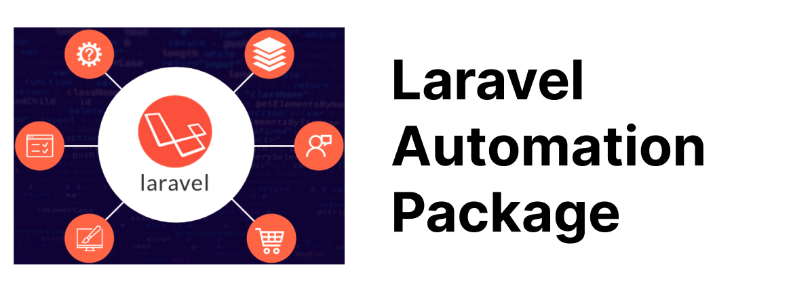
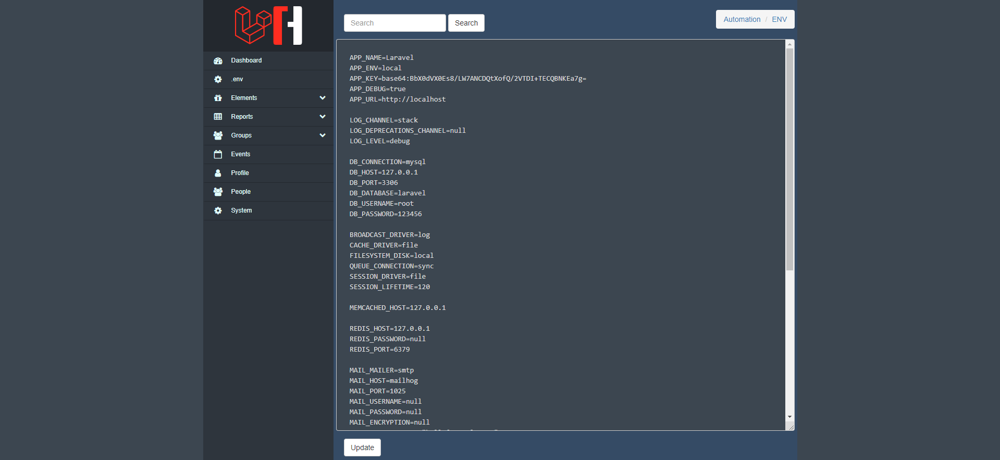

# Laravel Automation Package

This package help you to build a crud system without any coding.

## Introduction

This package help you to build a crud system without any coding.

## Supported Versions

Only the latest major version of Laravel UI receives bug fixes. The table below lists compatible Laravel versions:

| Version | Laravel Version |
| ------- | --------------- |
| 1.x     | 7.x, 8.x        |
| 2.x     | 9.x             |

## Installation

Require this package with composer. It is recommended to only require the package for development.

```
    composer require jmrashed/automation
```

Laravel uses Package Auto-Discovery, so doesn't require you to manually add the ServiceProvider.

## Laravel without auto-discovery:

If you don't use auto-discovery, add the ServiceProvider to the providers array in config/app.php

```php
    // 'config/app.php'
    <?php

    'providers' => [
        App\Providers\AutomationServiceProvider::class,
    ],
```

If you want to use the facade to log messages, add this to your facades in app.php:

```php
 'Automation' => Jmrashed\Automation\App\Facades\Automation::class,
```

## Publish Laravel Automation Package

```
    artisan vendor:publish --provider="Jmrashed\Automation\App\Providers\AutomationServiceProvider"
```

## Usage in Controller

```php
    // call automation
    Automation::create('Model');
```

## Usage in Blade

```
    // call automation
    {{ automation('Model')}}
```

The views can then be exported by users of our package using:

```
    php artisan vendor:publish --provider="Jmrashed\Automation\App\Providers\AutomationServiceProvider" --tag="views"
```

The assets can then be exported by users of our package using:

```
    php artisan vendor:publish --provider="Jmrashed\Automation\App\Providers\AutomationServiceProvider" --tag="assets"
```

## Directory Structure

```
    - src
    - tests
    CHANGELOG.md
    README.md
    LICENSE
    composer.json
```

In a package, all code that would live in the app/ directory of a Laravel application will live in the src/ directory when working with a package.

## Contributing

Thank you for considering contributing to UI! The contribution guide can be found in the Laravel documentation.

## Code of Conduct

In order to ensure that the Laravel community is welcoming to all, please review and abide by the Code of Conduct.

## Security Vulnerabilities

Please review our security policy on how to report security vulnerabilities.

## License

Laravel Automation Package is open-sourced software licensed under the [MIT license](LICENSE).


